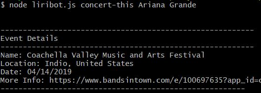
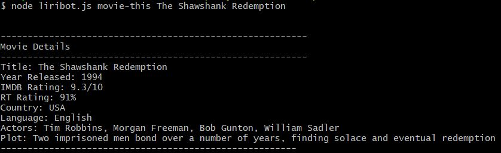
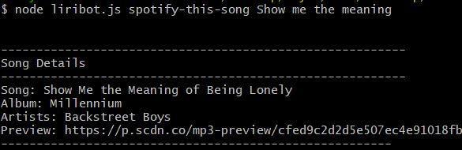
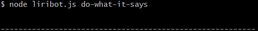

# Liri Bot - A Node JS Application

## Getting Started

These instructions will get you a copy of the application up and running on your local machine for development and testing purposes.

This is a Node JS application that accepts the below command line options and returns results

- concert-this&nbsp;&nbsp;&nbsp;&nbsp;*band/artist-name*
- movie-this&nbsp;&nbsp;&nbsp;&nbsp;*movie-name*
- spotify-this-song&nbsp;&nbsp;&nbsp;&nbsp;*song-title*
- do-what-it-says

## Application Folder structure

```
.
|-- README.md
|-- images
|   |-- concert-this.JPG
|   |-- do-what-it-says.JPG
|   |-- movie-this.JPG
|   `-- spotify-this-song.JPG
|-- keys.js
|-- liribot.js
|-- package-lock.json
|-- package.json
`-- random.txt

```
## Prerequisites

Install dependencies using Node Package Manager

```
$ npm install
```

Create Spotify developer account and add the below details to .env file under the application root dircetory

```
SPOTIFY_ID=your-Client-ID
SPOTIFY_SECRET=your-Client-Secret
```

Visit https://developer.spotify.com/documentation/web-api/quick-start/ for more details.

## How to run the application

 

 

 

 

